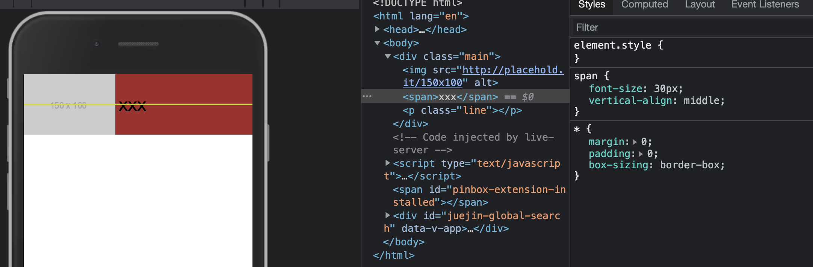
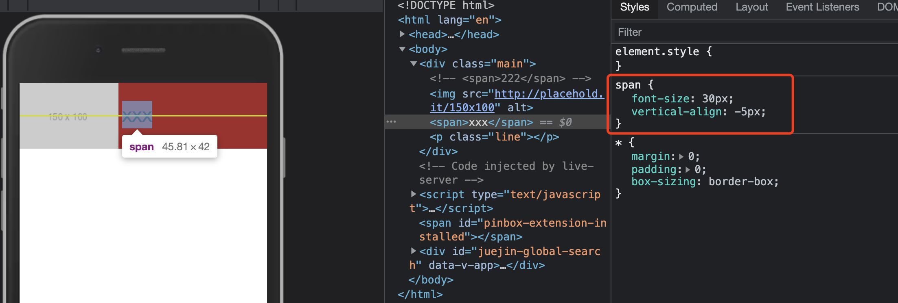
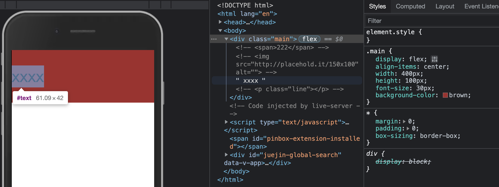
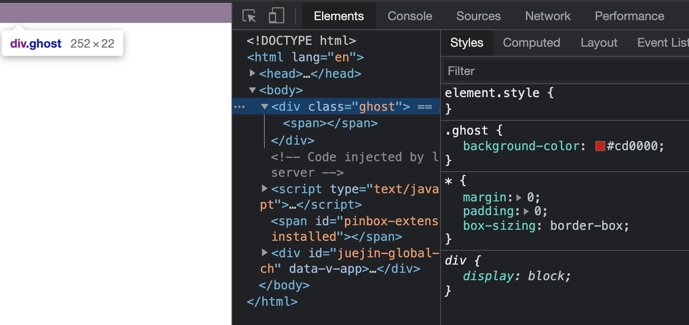

很多人开始接触到文字垂直居中的时候一般都是靠以下两行代码

```
line-height: 24px;
height: 24px;
```

其实这个概念是很容易误导初学者的，line-height只是使控制文字对齐的元素之一，下面介绍下相关的知识，并解释下为什么仅靠这两行代码并不能实现精确的垂直居中。

### 内联元素默认基线对齐（vertical-align:baseline）

#### 哪些元素是内联元素？

display为inline/inline-block/inline-table的都属于内联元素。


从表现行为上来看，“内联元素”典型的特征就是和文字在一行显示，因此`文字/图片/按钮/输入框/下拉框`等表单控件也是内联元素。---引自 张鑫旭 《css世界》

**重点：文字属于内联元素，沿基线对齐。**
文章开头提出的问题有答案了，当你指定line-height之后，所有的内联元素还是沿着基线对齐，所以仅靠line-height是无法完成文字的垂直居中的。

#### 什么是基线（baseline）？

**`小写字母x`的下边缘就是我们的基线**
> 为什么会选小写字母x为基线，很容易想通，小写字母是轴对称图形，上下边都是平整的，而不是像s一样上下边是弯曲的。
##### 扩展概念：x-height

定义：小写字母x的高度
扩展：尺寸单位ex是css中的一个相对单位，指的是小写字母x的高度（x-height）

### line-height（行高）

定义的就是两行基线的间距

#### 可能出现的值：
- 数值：所有的子元素继承的都是这个值
- 百分比或者长度值：所有的子元素继承的是最终的计算值

> 提示：内联元素span不能设置宽高，但支持line-height行高设置

### line-height的好基友`vertical-align`

#### vertical-align的属性值
- 线类：baseline(default)/top/middle/bottom
- 文本类：text-top/text-bottom
- 上标下标类：sub/super
- 数值百分比类：20px/2em/20%(后面两个比较少用)

#### line-height+vertical-align:middle也只是近似的垂直居中


middle是指沿着基线往上1/2 x-height高度对齐，可以近似理解为字母x交叉点的位置

> 并不是绝对的居中对齐，因为不同的字体在行内盒子中的位置不一样，比如微软雅黑就是一个下沉比较明显的字体，所有字符的位置都比其他字体要偏下一点，字母x的交叉点是在容器中分线的下面一点。

#### vertical-align为一个数值来解决精确垂直居中的问题
vertical-align:baseline其实就是vertical-align:0
需要精确解决垂直居中的问题是需要在这个基础上进行调试的，比如设置vertical-align为-5px
```
vertical-align:-5px;
```


#### 注意点： vertical-align作用条件

可能会有人觉得vertical-align看似好用，但是有时候不起作用，但其实你需要知道它的使用条件：**只能应用于内联元素以及display值为table-cell的元素**

### 探索：display:flex+align-items:center能实现精确的文字垂直居中吗？
我们不如先来尝试下


可以见得，万能的flex布局实现了文字垂直居中，但文字受到多种因素的影响，精确的垂直居中其实是比较难实现的。

### 补充知识：div的高度是由行高决定的

> 1. 知识补充：替换元素（如image/video/input等这种替换某个属性就可以改变的元素）
> 2. 行距 = line-height - font-size
> 3. 半行距 = 行距 / 2

对于块级元素，line-height对其本身是没有任何作用的，块级元素的高度跟着变化实际上是通过改变块级元素里面内联级别元素占据的高实现的

- 对于非替换元素的纯内联元素，其可视高度完全由line-height决定
- 纯文本：line-height决定最终高度
- 子元素含有替换元素，line-height只能决定最小高度
  > 原因：一是替换元素的高度不受line-height影响，二是vertical-align属性在背后作祟

### 有意思的概念：幽灵空白节点

`内联元素`的所有解析和渲染表现就如同每个行框盒子的前面有一个“空白节点”一样。
`透明`，`不占据任何宽度和高度`，就好像幽灵一样，看不见，却又确实撑开了父元素。
```
<style>
span {
  display:inline-block
}
</style>

<div>
  <span></span>
</div>
```

> 对幽灵空白节点的解释：可以认为在span元素的前面还有一个宽度为0的空白字符。

### 总结
其实对于前端来说，市面上常见的垂直居中方案是足以满足我们的需求的，有时候受到字体因素等的影响有略微差距其实也是可以接受的，只要你弄清楚它的原理或许你就不会这么困惑了。