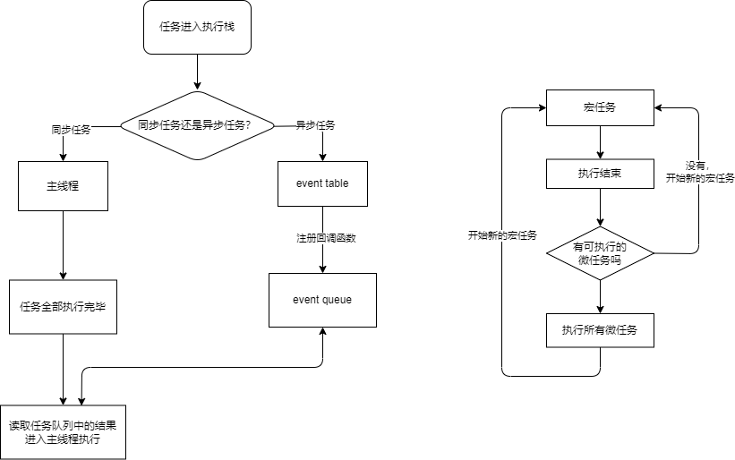

# 事件循环

## node中的事件循环

在进程启动时，Node便会创建一个类似于`while(true)`的循环，每执行一次循环体的过程我们称为Tick。
每个Tick的过程就是查看是否有事件待处理，如果有，就取出事件及其相关的回调函数。
如果存在关联的回调函数，就执行它们。

## 异步任务

### 微任务

一个需要异步执行的函数，执行时机是在主函数执行结束之后、当前宏任务结束之前

常见的微任务有：

- Promise.then
- MutaionObserver
- Object.observe（已废弃；Proxy 对象替代）
- process.nextTick（Node.js）

### 宏任务

宏任务的时间粒度比较大，执行的时间间隔是不能精确控制的，对一些高实时性的需求就不太符合

常见的宏任务有：

- script (可以理解为外层同步代码)
- setTimeout/setInterval
- UI rendering/UI事件
- postMessage、MessageChannel
- setImmediate、I/O（Node.js）
j
### 执行流程

执行一个宏任务，如果遇到微任务就将它放到微任务的事件队列中
当前宏任务执行完成后，会查看微任务的事件队列，然后将里面的所有微任务依次执行完

## 流程图
